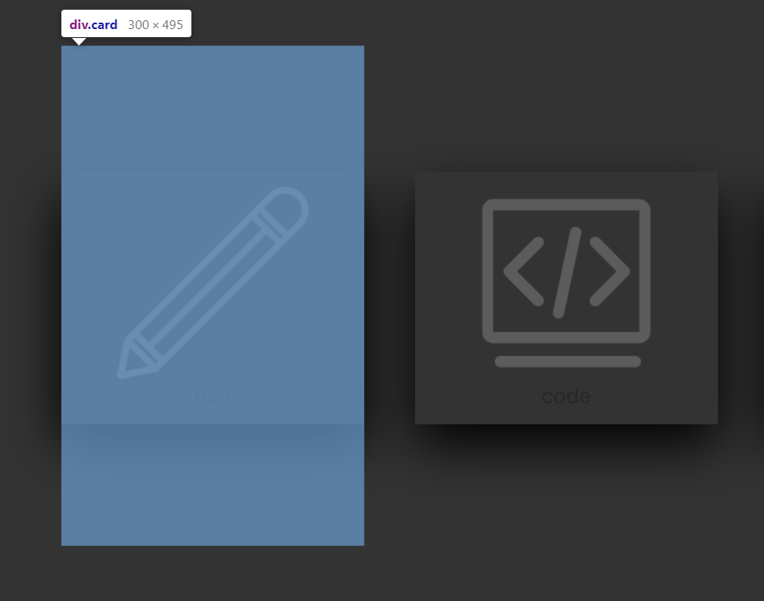

# 前端项目练习

## 1.[tribute-page](https://gaays.github.io/Front-end-Exercises/tribute-page/index.html)
跟freecodecamp学前端，练习贡献页面（响应式布局）

## 2.[商城练习](https://gaays.github.io/Front-end-Exercises/shop/index.html)

模拟练习搭建一个商城展示页面,可按时间、价格、热度排序

### 学到的知识：

- JS ES6新规范中的模板字符串;
- JS ES6新规范中的…运算符赋值相关操作;
- JS ES6新规范的this指向,指向继承父级this。而ES5中this指向该函数被调用的对象;
- JS ``appendChild()``  在追加元素对象时如果这个元素之前容器中已存在，此时不是克隆一份新的追加到末尾，而是把原有的元素移动到末尾位置。
- …

### 修改历史：

**19/11/21** 
修改逻辑bug: 对sortList变量的值修改

## 3.[商品选择页面练习](https://gaays.github.io/Front-end-Exercises/product-list/index.html)

### 学到的知识：

- CSS 使用`transition`属性不仅可以移动元素位置，还可以添加动画效果让页面变得更加精致。
- CSS 使用`input::placeholder`可以改变文本框placeholder的样式。
- CSS flex知识。

### 修改历史：

**19/11/26**
优化代码逻辑

**19/11/27**
根据昨天练习的CSS搜索框，添加了搜索框、购物车、收藏按钮的动画效果

**19/11/28**
使用less重写css，初步实现翻页动画

**19/11/30-19/12/1**

[用bootstrap重写，实现响应式布局](https://gaays.github.io/Front-end-Exercises/product-list-bootstrap/index.html)

## 4.[搜索框](https://gaays.github.io/Front-end-Exercises/search-list/index.html)

## 5.[hover card](https://gaays.github.io/Front-end-Exercises/hover-animation/index.html)

**bug：**

因为使用相对定位，所以card的区域实际上为蓝框区域，此区域内:hover伪类都会触发

**....**

